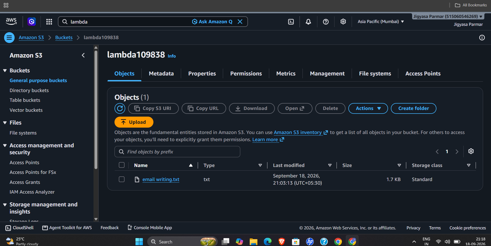
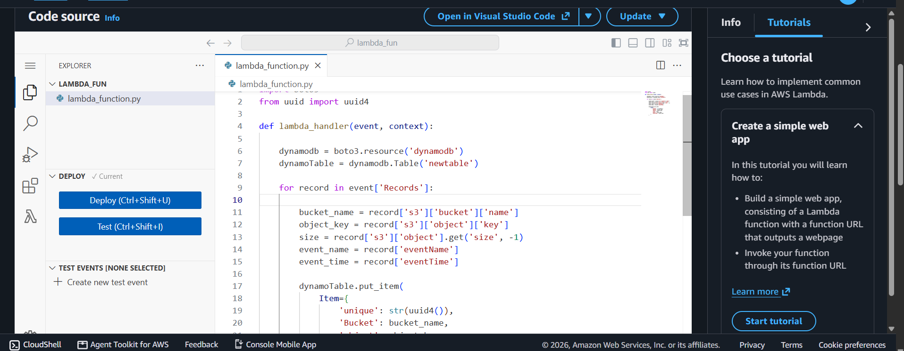
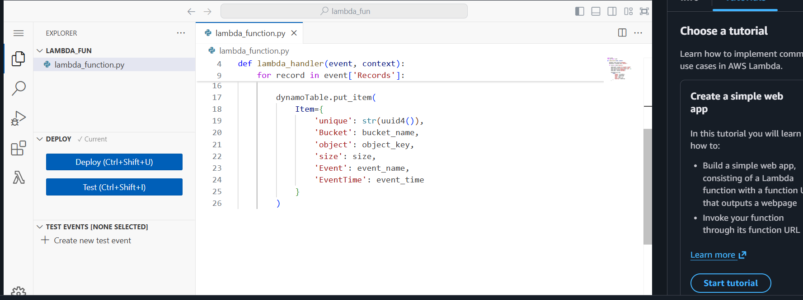
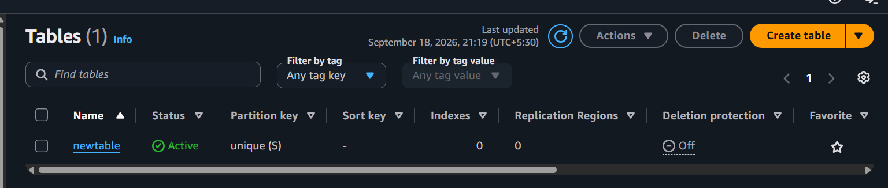
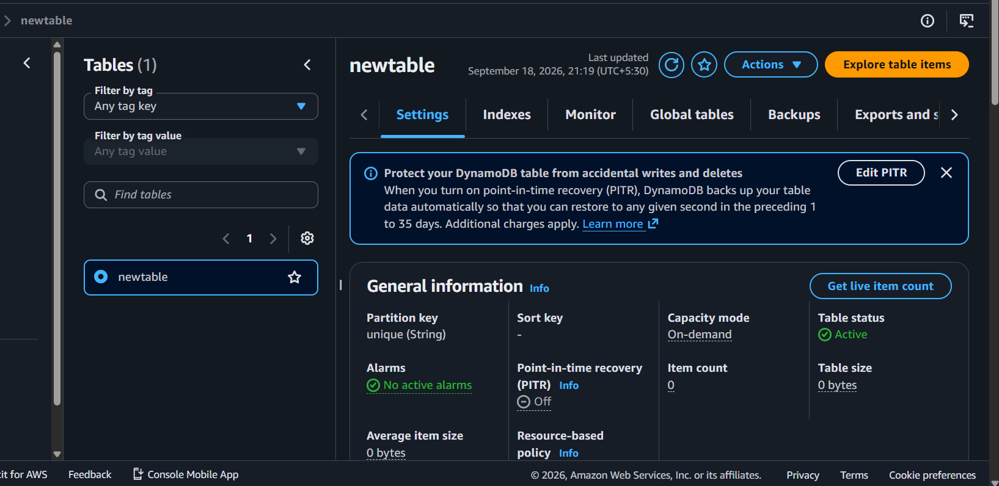
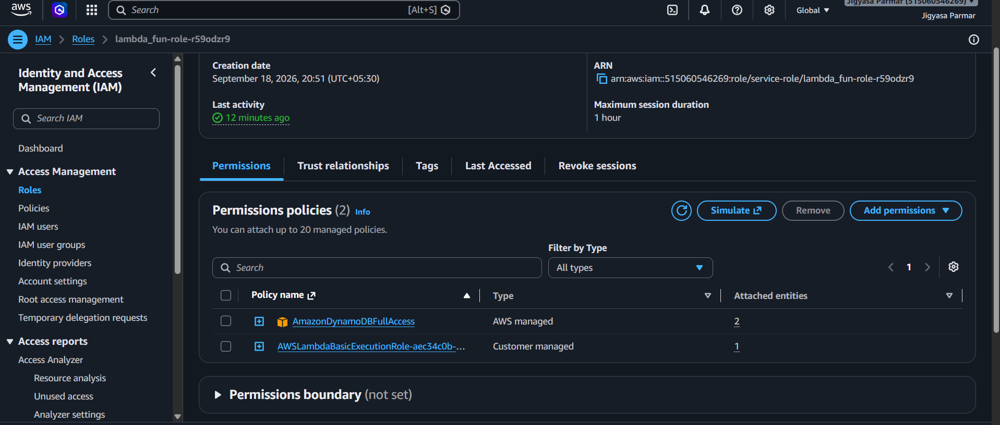
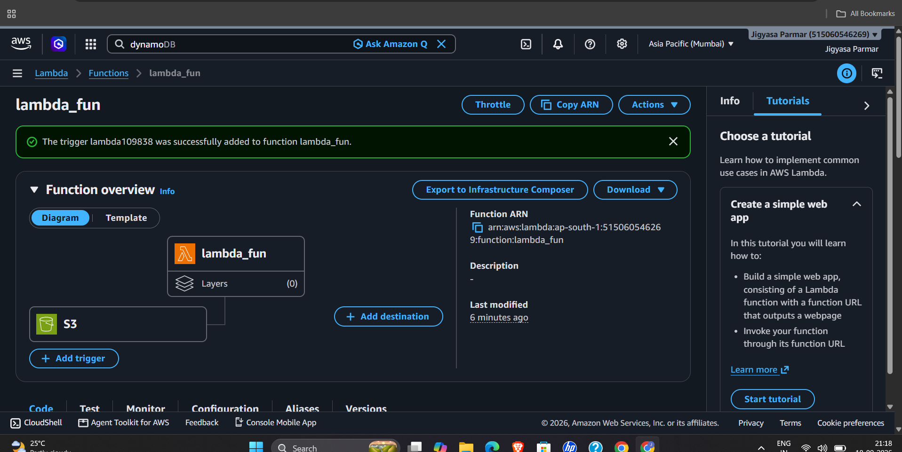
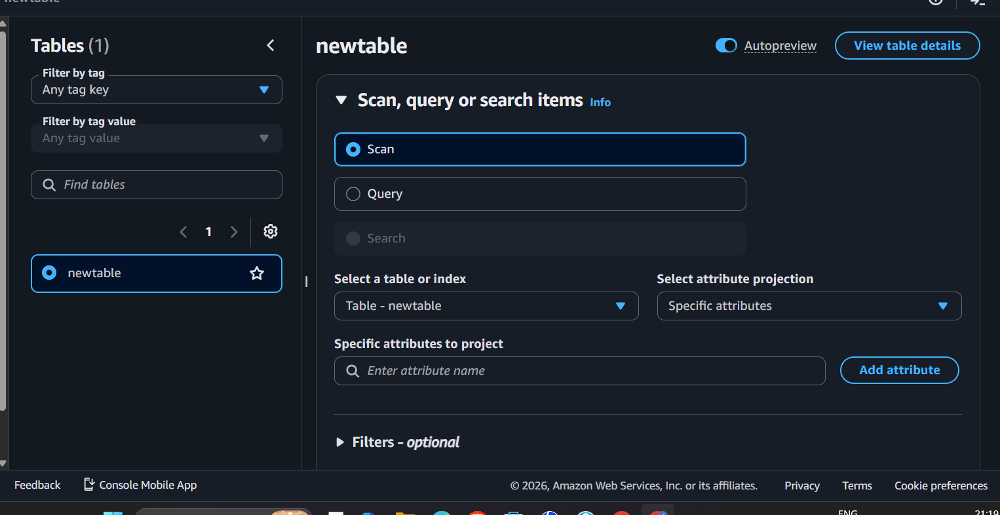
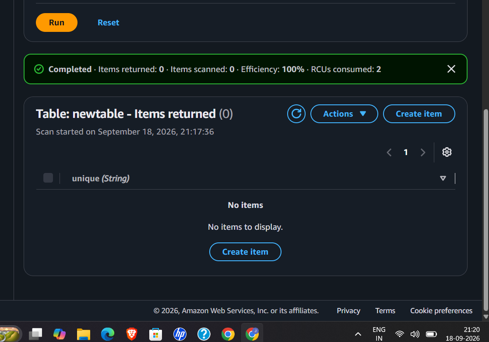

# AWS S3 Activity Logger using Lambda and DynamoDB

An event-driven AWS project that automatically captures activity performed on an Amazon S3 bucket and stores the event metadata in Amazon DynamoDB using AWS Lambda and IAM permissions.

## Architecture

```text
                 User
                  |
                  | Upload / S3 Object Activity
                  v
        +---------------------+
        |     Amazon S3       |
        |   Bucket            |
        +----------+----------+
                   |
                   | S3 Event Notification
                   v
        +---------------------+
        |     AWS Lambda      |
        |    lambda_fun       |
        +----------+----------+
                   |
                   | IAM Execution Role
                   | DynamoDB permissions
                   v
        +---------------------+
        |    Amazon DynamoDB  |
        |      newtable       |
        +---------------------+
                   |
                   v
          Activity Metadata
```

## Project Objective

The objective of this project is to build an automated S3 activity logging system.

Whenever a user performs a configured activity on the S3 bucket, Amazon S3 generates an event. The event automatically invokes AWS Lambda. Lambda reads the event information and stores the relevant metadata in DynamoDB.

This removes the need to manually record or copy S3 activity information.

## AWS Services Used

- **Amazon S3** — stores objects and generates event notifications.
- **AWS Lambda** — processes S3 events automatically.
- **Amazon DynamoDB** — stores S3 activity metadata.
- **AWS IAM** — provides Lambda with permission to write to DynamoDB.
- **Amazon CloudWatch Logs** — available for monitoring Lambda executions and troubleshooting.

## Features

- Event-driven architecture
- Automatic Lambda invocation from S3
- Automatic DynamoDB record creation
- IAM-based authorization
- Unique ID generated for every event
- Stores bucket name, object name, object size, event type, and event time
- No manual database update is required

---

# Implementation

## Step 1 — Create the S3 Bucket

An S3 bucket named `lambda109838` was used for this project.

The bucket was used as the source of S3 object activity.

### Screenshot



> **Note:** For this learning project, bucket access settings were configured according to the testing requirement. In a production environment, avoid making an S3 bucket public unless there is a specific business requirement. Prefer private buckets with IAM/bucket policies and least-privilege access.

---

## Step 2 — Create the Lambda Function

A Lambda function named:

```text
lambda_fun
```

was created using Python.

The Lambda function is responsible for reading the S3 event and writing the event information to DynamoDB.

### Lambda Code

```python
import boto3
from uuid import uuid4

def lambda_handler(event, context):

    dynamodb = boto3.resource('dynamodb')
    dynamoTable = dynamodb.Table('newtable')

    for record in event['Records']:

        bucket_name = record['s3']['bucket']['name']
        object_key = record['s3']['object']['key']
        size = record['s3']['object'].get('size', -1)
        event_name = record['eventName']
        event_time = record['eventTime']

        dynamoTable.put_item(
            Item={
                'unique': str(uuid4()),
                'Bucket': bucket_name,
                'object': object_key,
                'size': size,
                'Event': event_name,
                'EventTime': event_time
            }
        )
```

### How the code works

### 1. Import AWS SDK

```python
import boto3
```

`boto3` is the AWS SDK for Python. It allows the Lambda function to communicate with AWS services such as DynamoDB.

### 2. Generate a unique ID

```python
from uuid import uuid4
```

`uuid4()` generates a unique identifier for each DynamoDB record.

### 3. Connect to DynamoDB

```python
dynamodb = boto3.resource('dynamodb')
dynamoTable = dynamodb.Table('newtable')
```

Lambda connects to DynamoDB and selects the `newtable` table.

### 4. Read S3 event records

```python
for record in event['Records']:
```

An S3 event can contain one or more records, so the function loops through each record.

### 5. Extract event information

```python
bucket_name = record['s3']['bucket']['name']
object_key = record['s3']['object']['key']
size = record['s3']['object'].get('size', -1)
event_name = record['eventName']
event_time = record['eventTime']
```

The Lambda function extracts:

| Attribute | Description |
|---|---|
| `Bucket` | Name of the S3 bucket |
| `object` | Object/file name |
| `size` | Object size |
| `Event` | S3 event type |
| `EventTime` | Time when the event occurred |
| `unique` | Unique ID generated by Lambda |

### 6. Store the record

```python
dynamoTable.put_item(...)
```

The extracted event information is inserted into DynamoDB.

### Lambda Screenshot





---

# Step 3 — Create the DynamoDB Table

A DynamoDB table named:

```text
newtable
```

was created.

The partition key is:

```text
unique
```

with data type:

```text
String
```

### Screenshot



### Table Configuration

- Table name: `newtable`
- Partition key: `unique`
- Partition key type: String
- Capacity mode: On-demand

### Table Settings Screenshot



---

# Step 4 — Configure IAM Permissions

Lambda needs permission to write data into DynamoDB.

An IAM execution role was attached to the Lambda function.

The role contains:

```text
AmazonDynamoDBFullAccess
```

and the basic Lambda execution policy.

### Screenshot



### Why IAM is required

Lambda does not automatically have permission to modify DynamoDB.

The IAM execution role tells AWS:

> This Lambda function is allowed to perform the required DynamoDB operations.

For this learning project, `AmazonDynamoDBFullAccess` was used.

### Production improvement

For a production environment, use a **least-privilege IAM policy** that grants only the required action, such as:

```text
dynamodb:PutItem
```

on the specific `newtable` resource instead of granting full DynamoDB access.

---

# Step 5 — Configure S3 as the Lambda Trigger

The S3 bucket was configured as a trigger for the Lambda function.

The trigger connects:

```text
S3 Bucket → Lambda Function
```

When the configured S3 activity occurs, S3 automatically invokes Lambda.

### Screenshot



The AWS console confirmed:

```text
The trigger lambda109838 was successfully added to function lambda_fun.
```

---

# Step 6 — Deploy the Lambda Function

After writing the Lambda code, the function was deployed using the **Deploy** button.

A manual Lambda Test event was not required for the final integration test because the actual S3 event was used.

The real test was:

```text
Upload object to S3
        ↓
S3 generates event
        ↓
Lambda is automatically invoked
        ↓
Lambda processes event
        ↓
DynamoDB PutItem
        ↓
Record appears in newtable
```

---

# Step 7 — Test the Complete Architecture

A new file was uploaded to the S3 bucket after the Lambda trigger was configured.

Example:

```text
test2.txt
```

After the upload, the S3 event triggered Lambda automatically.

Lambda processed the event and inserted the information into DynamoDB.

### Important Testing Point

Objects uploaded **before** the S3 → Lambda trigger was configured do not automatically get replayed by the trigger.

Therefore, a **new object upload after configuring the trigger** should be used for testing.

---

# Step 8 — Verify Data in DynamoDB

The DynamoDB table was opened using **Explore table items**.

A Scan operation was performed to verify the records.

### Before Successful Test

The table initially showed:

```text
Items returned: 0
```



After uploading a new object with the trigger correctly configured, the Lambda function processed the event and the DynamoDB table could be used to verify the resulting record.



---

# End-to-End Workflow

The complete workflow is:

```text
1. User performs an activity on S3
              ↓
2. S3 generates an event
              ↓
3. S3 invokes Lambda
              ↓
4. Lambda receives event['Records']
              ↓
5. Lambda extracts:
       - Bucket name
       - Object key
       - Object size
       - Event name
       - Event time
              ↓
6. Lambda uses its IAM execution role
              ↓
7. Lambda calls DynamoDB PutItem
              ↓
8. DynamoDB stores the event metadata
```

---

# Example DynamoDB Record

A resulting DynamoDB item has the following structure:

```json
{
  "unique": "generated-uuid",
  "Bucket": "lambda109838",
  "object": "test2.txt",
  "size": 1234,
  "Event": "ObjectCreated:Put",
  "EventTime": "2026-09-18T..."
}
```

The exact values depend on the S3 event generated during testing.

---

# Error Handling and Troubleshooting

If the DynamoDB table does not update:

### 1. Check the S3 trigger

Verify that:

```text
S3 → Lambda
```

is configured correctly.

### 2. Upload a NEW object

Do not rely on an object uploaded before the trigger was created.

### 3. Check IAM permissions

The Lambda execution role must have permission to write to DynamoDB.

### 4. Check the DynamoDB table name

The Lambda code uses:

```python
dynamodb.Table('newtable')
```

Therefore the DynamoDB table must be named:

```text
newtable
```

### 5. Check Lambda logs

Go to:

```text
Lambda → lambda_fun → Monitor → CloudWatch logs
```

CloudWatch logs can show execution errors such as permission problems, incorrect event structure, or code errors.

---

# Security Considerations

This project was created as a learning/demo environment.

For production deployment:

- Keep S3 buckets private unless public access is explicitly required.
- Enable appropriate S3 Block Public Access settings.
- Use least-privilege IAM policies.
- Give Lambda only the DynamoDB permissions it actually needs.
- Restrict access to specific DynamoDB resources.
- Consider encryption and appropriate logging/monitoring.
- Avoid hard-coding credentials in Lambda code. IAM roles should be used.

---

# Skills Demonstrated

This project demonstrates practical knowledge of:

- Amazon S3
- AWS Lambda
- Amazon DynamoDB
- AWS IAM
- Event-driven architecture
- S3 Event Notifications
- Lambda execution roles
- Python with `boto3`
- DynamoDB `PutItem`
- CloudWatch-based troubleshooting
- AWS service-to-service integration

---

# Resume Description

**Event-Driven S3 Activity Logger | AWS**

- Built an event-driven AWS architecture using Amazon S3, AWS Lambda, DynamoDB, and IAM.
- Configured S3 event notifications to automatically trigger a Python Lambda function on bucket activity.
- Developed Lambda logic using `boto3` to extract S3 event metadata and store records in DynamoDB.
- Configured IAM execution permissions for secure Lambda-to-DynamoDB communication and validated the workflow through real S3 object uploads.

---

# Future Improvements

Possible enhancements for this project:

- Add Amazon SNS notifications for important S3 activities.
- Create a CloudWatch dashboard for Lambda activity.
- Replace full DynamoDB permissions with a custom least-privilege IAM policy.
- Add filters for specific S3 prefixes or file types.
- Add a frontend/dashboard to visualize stored activity.
- Add error handling and structured logging.
- Add infrastructure as code using AWS CloudFormation or Terraform.

---

# Project Architecture Summary

```text
                    AWS CLOUD
        ┌─────────────────────────────┐
        │                             │
        │   User                       │
        │    │                         │
        │    │ S3 Activity             │
        │    ▼                         │
        │  ┌───────────────┐           │
        │  │   Amazon S3   │           │
        │  └───────┬───────┘           │
        │          │ Event              │
        │          ▼                    │
        │  ┌───────────────┐           │
        │  │ AWS Lambda    │           │
        │  │ lambda_fun    │           │
        │  └───────┬───────┘           │
        │          │                    │
        │          │ IAM Role           │
        │          ▼                    │
        │  ┌───────────────┐           │
        │  │  DynamoDB     │           │
        │  │   newtable    │           │
        │  └───────────────┘           │
        │                             │
        └─────────────────────────────┘
```

## Conclusion

This project demonstrates how AWS services can be connected to create an automated, event-driven backend.

Instead of manually monitoring S3 activity and entering information into a database, S3 generates an event, Lambda processes it automatically, and DynamoDB stores the resulting activity metadata.

**S3 → Lambda → IAM → DynamoDB**

This architecture provides a practical example of serverless, event-driven AWS integration.
